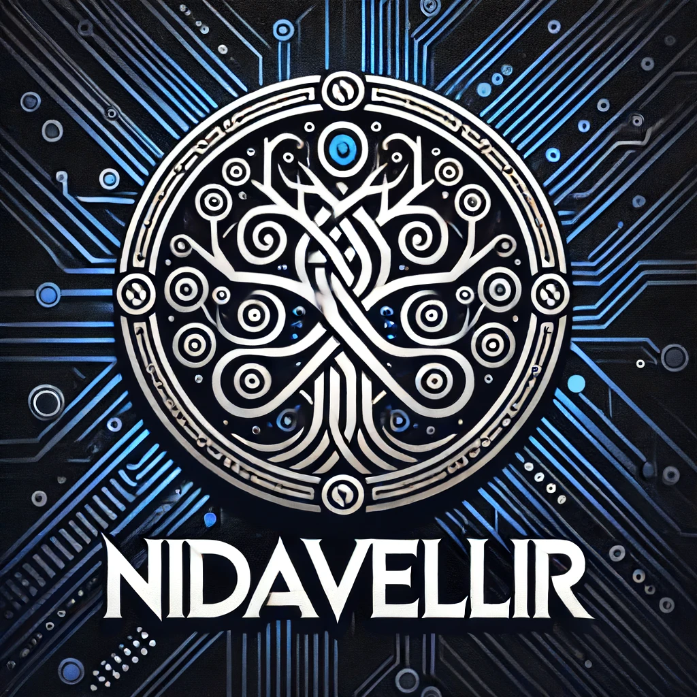

[![Contributors][contributors-shield]][contributors-url]
[![Forks][forks-shield]][forks-url]
[![Stargazers][stars-shield]][stars-url]
[![Issues][issues-shield]][issues-url]
[![MIT License][license-shield]][license-url]
[![Build][workflow-shield]][workflow-url]


<!-- PROJECT LOGO -->
<br />
<div align="center">
  <a href="https://github.com/QuasiData/nidavellir">
    
  </a>
  <a href="https://github.com/QuasiData/nidavellir">
  </a>

<h3 align="center">Nidavellir</h3>

  <p align="center">
    An entity component system written in C++
    <br />
    <a href="https://quasidata.github.io/nidavellir/"><strong>Explore the docs »</strong></a>
    <br />
    <br />
    ·
    <a href="https://github.com/QuasiData/nidavellir/issues/new?labels=bug&template=bug-report---.md">Report Bug</a>
    ·
    <a href="https://github.com/QuasiData/nidavellir/issues/new?labels=enhancement&template=feature-request---.md">Request Feature</a>
  </p>
</div>


<!-- TABLE OF CONTENTS -->
<details>
  <summary>Table of Contents</summary>
  <ol>
    <li>
      <a href="#about-the-project">About The Project</a>
    </li>
    <li>
      <a href="#getting-started">Getting Started</a>
      <ul>
        <li><a href="#prerequisites">Prerequisites</a></li>
        <li><a href="#installation">Installation</a></li>
      </ul>
    </li>
    <li><a href="#usage">Usage</a></li>
    <li><a href="#roadmap">Roadmap</a></li>
    <li><a href="#contributing">Contributing</a></li>
    <li><a href="#license">License</a></li>
    <li><a href="#contact">Contact</a></li>
    <li><a href="#acknowledgments">Acknowledgments</a></li>
  </ol>
</details>


<!-- ABOUT THE PROJECT -->
## About The Project

About...

<p align="right">(<a href="#readme-top">back to top</a>)</p>


<!-- GETTING STARTED -->
## Getting Started

Setup

### Prerequisites

* cmake https://cmake.org/

### Installation

1. Clone the repo
   ```sh
   git clone --recursive https://github.com/QuasiData/nidavellir.git
   ```
2. Move to the repo
    ```sh
    cd nidavellir
    ```

3. Build and run tests
    ```sh
    cmake --workflow --preset=x64-{platform}-{compiler}-{config}
    ```

4. Example
    ```sh
    cmake --workflow --preset=x64-linux-gcc-release
    ```

<p align="right">(<a href="#readme-top">back to top</a>)</p>


<!-- USAGE EXAMPLES -->
## Usage

Usage examples

_For more examples, please refer to the [Documentation](https://quasidata.github.io/nidavellir/)_

<p align="right">(<a href="#readme-top">back to top</a>)</p>


<!-- ROADMAP -->
## Roadmap

See the [open issues](https://github.com/QuasiData/nidavellir/issues) for a full list of proposed features (and known issues).

<p align="right">(<a href="#readme-top">back to top</a>)</p>

<!-- CONTRIBUTING -->
## Contributing

This is a learning project and as such I wont accept any contributions, yet...

<p align="right">(<a href="#readme-top">back to top</a>)</p>


<!-- LICENSE -->
## License

Distributed under the MIT License. See `LICENSE.txt` for more information.

<p align="right">(<a href="#readme-top">back to top</a>)</p>

<!-- MARKDOWN LINKS & IMAGES -->
<!-- https://www.markdownguide.org/basic-syntax/#reference-style-links -->
[workflow-shield]: https://github.com/QuasiData/nidavellir/actions/workflows/build-linux.yml/badge.svg
[workflow-url]: https://github.com/QuasiData/nidavellir/actions/workflows/build-linux.yml/badge.svg
[contributors-shield]: https://img.shields.io/github/contributors/QuasiData/nidavellir.svg?style=for-the-badge
[contributors-url]: https://github.com/QuasiData/nidavellir/graphs/contributors
[forks-shield]: https://img.shields.io/github/forks/QuasiData/nidavellir.svg?style=for-the-badge
[forks-url]: https://github.com/QuasiData/nidavellir/network/members
[stars-shield]: https://img.shields.io/github/stars/QuasiData/nidavellir.svg?style=for-the-badge
[stars-url]: https://github.com/QuasiData/nidavellir/stargazers
[issues-shield]: https://img.shields.io/github/issues/QuasiData/nidavellir.svg?style=for-the-badge
[issues-url]: https://github.com/QuasiData/nidavellir/issues
[license-shield]: https://img.shields.io/github/license/QuasiData/nidavellir.svg?style=for-the-badge
[license-url]: https://github.com/QuasiData/nidavellir/blob/master/LICENSE.txt